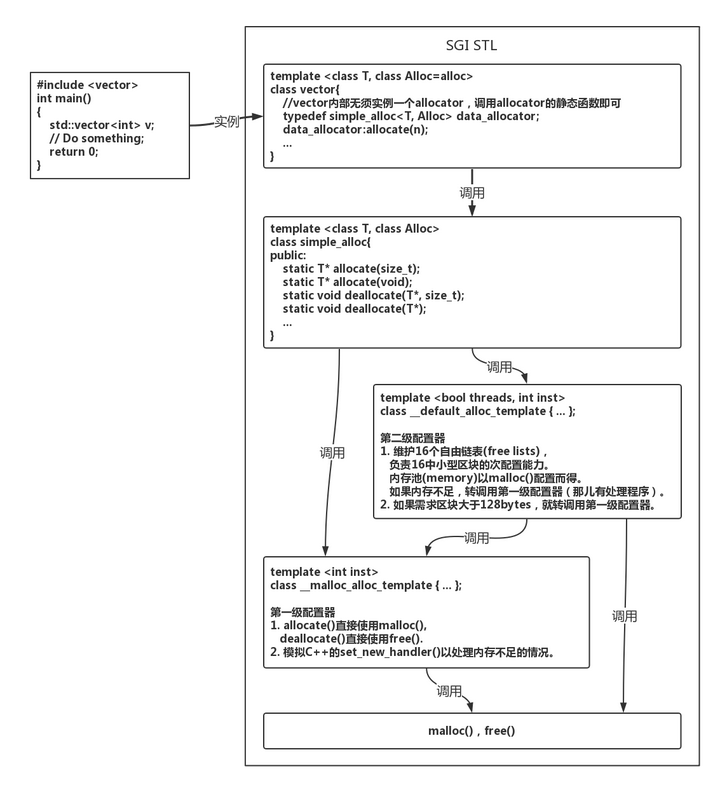
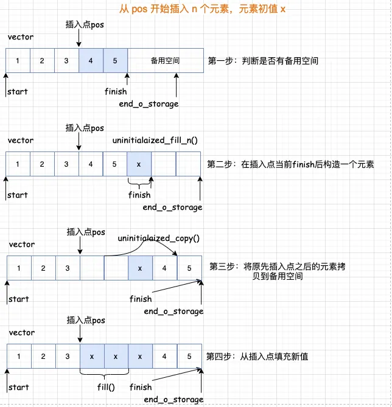
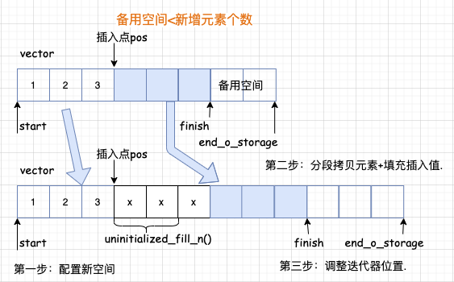
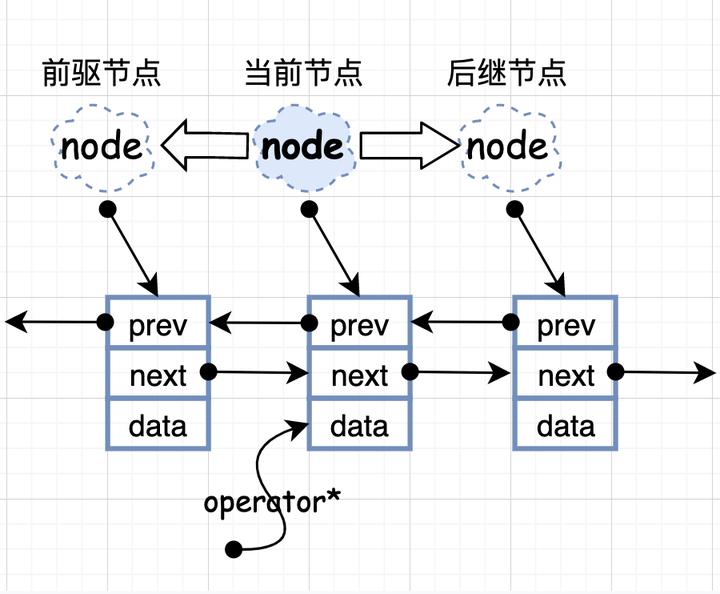
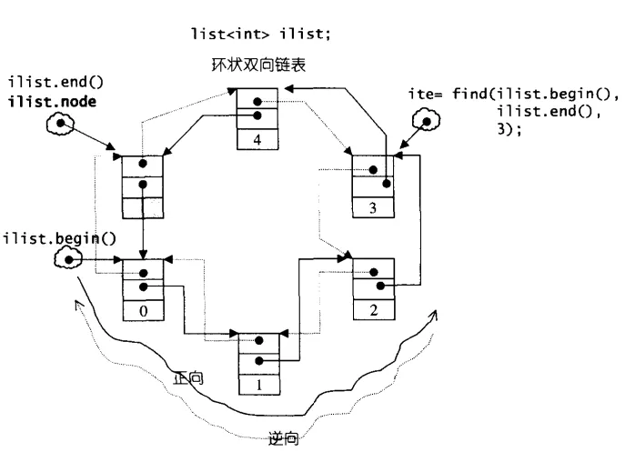

# STL六大组件

1. 容器（containers）：各种数据结构，如 vector，list，deque，set，map，用来存放数据。STL容器是一种class template。
2. 算法（algorithm）：各种常用算法如 sort，search，copy，erase...也算一种function template。
3. 迭代器（iterator）：扮演容器与算法之间的胶合剂，是所谓的“泛型指针”，共有5种类型，以及其它衍生变化，迭代器是一种将`operator*`，`operator->`，`operator++`，`operator--`等指针相关操作予以重载的class template。所有STL容器都附带有自己专属的迭代器——只有容器设计者才知道如何遍历自己的元素，原生指针（native pointer）也是一种迭代器。
4. 仿函数（functors）：行为类似函数，可作为算法的某种策略（policy），重载了`operator()`的class或class template。
5. 配接器（adapters）：一种用来修饰容器或仿函数或迭代器接口的东西，例如STL提供的queue和stack，虽然看似容器，其实只能算是一种容器适配器，因为它们的底部完全借助deque，所有操作都是由底层的deque供应。改变functor接口者，称为function adapter；改变container接口者，称为container adapter；改变iterator接口者，称为iterator adapter。
6. 配置器（allocators）：负责空间配置与管理，配置器是一个实现了动态空间配置、空间管理、空间释放的class template。

Container通过Allocator取得数据储存空间，Algorithm通过Iterator存取Container内容，Functor可以协助Algorithm完成不同的策略变化，Adapter可以修饰或套接Functor。

# std::alloc

## 内存分配模型

### 重载new和delete操作的目的

C++提供的默认版本的new和delete运算符，无法在他们执行操作之前，对被操作的对象的数据成员执行一些自定义的逻辑操作，那么我们此时就要考虑重载C++中的new操作符和delete操作符，它们操作符可以全局重载，也可以在特定类中重载。

1. 可以在重载新的运算符功能中添加异常处理。
2. 希望自定义运算符delete，以用0覆盖被回收的堆内存块，以提高应用程序数据的安全性。
3. 重载new操作符可以在其内部定义C版本的malloc或realloc函数进行对象的堆内存分配，然而C++并不建议如此做，因为这样已经绕过了标准库中默认的内存分配器的内存管理机制。
4. 同理delete操作也可以在其重载版本中定义C版本的free()函数，同样C++不建议如此做。

new/delete操作符的作用域
- 如果使用某个类的成员函数来重载这些运算符，则意味着这些运算符仅针对该特定类才被重载。
- 如果重载是在类外完成的（即它不是类的成员函数），则只要您使用这些运算符（在任何地方）都将调用重载的“new”和“delete”。

以下是new操作符函数的原型：
```c++
void* operator new(size_t size);
```

以下是delete操作符函数的原型：delete操作符必须匹配一个void*类型的参数，函数返回的类型是void，并且默认情况下，重载后的new和delete操作符函数都是静态成员，因此在函数内部是无法使用this指针。
```c++
void operator delete(void*);
```
该函数接收一个必须删除的void*类型的参数，函数不应该返回任何东西。
默认情况下，重载的new和delete运算符函数都是静态成员，因此，他们无权访问this指针。

## 内存池

我们无法改变malloc的动作，这也意味着我们无法改变每次调用malloc都会产生额外开销，所以，我们去进行优化的方法就只能是减少对malloc的调用次数。

```c++
void* malloc(int size);
```

实现方法：
1. 在第一次分配内存时，调用malloc一次性分配一大块内存，称为内存池。
2. 当需要分配内存时，首先检查内存池是否有足够的容量，如果有就直接从内存池中为其分配内存，若不存在则调用malloc为内存池再补充一大块内存。
3. 当已经被分配出的内存释放时，将它归还于内存池。

如此，我们可以很简单的减少了malloc的调用次数，尽管每一次调用malloc都会产生额外的开销，但相比直接调用malloc会优化很多。

## 具体实现

```c++
class Screen {
public:
    Screen(int x) : i(x) {}
    int get() {return i;}

    void* operator new(size_t);
    void operator delete(void*, size_t);
private:
    Screen *next;//指向下一块可用内存
    static Screen* freeStore;//内存池头节点指针
    static const int screenChunk;//每次分配的数量
private:
    int i;
};
Screen* Screen::freeStore = 0;
const int Screen::screenChunk = 24;
```

首先分析这个类的定义：
1. 构造函数，数据成员i和方法get，这三个成员无关紧要。
2. 重载了new和delete，很明显我们要改变new行为就只能通过重载这两个函数。
3. 一个指向本体的指针：当当前成员还在内存池中时，用于连接下一块内存。
4. 一个指向内存池头节点的指针：指向所维护的内存池的第一个可用内存。
5. 一个代表每次分配的数量的int，也就是每次调用malloc所一次性分配的大小。

```c++
void* Screen::operator new(size_t size)
{
    Screen *p;
    if (!freeStore)
    {
        //当链表为空时， 申请内存
        size_t chunk = screenChunk * size; // 计算需要分配的大小
        //分配内存并将指针转型
        freeStore = p = reinterpret_cast<Screen*>(new char[chunk]);
        //将这一大片内存分割，当作链表串联起来
        for (; p!= &freeStore[screenChunk - 1]; ++p)
            p->next = p + 1;
        p->next = 0;//将整个内存池链表最后设为0
    }
    p = freeStore; //取出内存池开头的一块内存
    freeStore = freeStore->next;//头指针后移
    return p;
}
```

接着，我们分析对于内存分配的动作：
1. 当freeStore为空时，也就证明当前内存池为空，那么就分配一大块内存给内存池。
2. 分配之后，得到一大块内存用之前定义的next指针串联在一起，这样就完成了逻辑上的分割，虽然物理上它们可能是相连的，但是只要我们分配的时候使用next指针，就能保证一块一块的分配出去。
3. 当freeStore不为空时（本身就不为空或已经分配了内存），就取出内存池的第一块内存给p，并且将头指针后移，然后返回p。

这也就是我们得到的内存池，头节点由freeStore指向，尾节点的next为0；

```c++
//重载的delete方法
void Screen::operator delete(void* p, size_t)
{
    //将当前内存块的头指针指向可用内存链表的开头
    (static_cast<Screen*>(p))->next = freeStore;
    freeStore = static_cast<Screen*>(p);
}
```

当已经分配出去的内存使用结束被delete时，我们将他再次连接到内存池的开头，这样就完成了归还动作。


# SGI STL 特殊配置器（std::alloc）



```c++
template<class T, class Alloc>
class simple_alloc 
{
public:
    static T* allocate(std::size_t n)
    {
        return 0==n ? 0 : (T*)Alloc::allocate(n * sizeof(T));
    }
    static T* allocate(void)
    {
        return (T*)Alloc::allocate(sizeof(T));
    }
    static void deallocate(T* p, size_t n)
    {
        if (n != 0)
        {
            Alloc::deallocate(p, n * sizeof(T));
        }
    }

    static void deallocate(T* p)
    {
        Alloc::deallocate(p, sizeof(T));
    }
};
```

# 序列式容器

## vector

```c++
template <class T, class Alloc = alloc>
class vector {
public:
   // 定义 vector 自身的嵌套型别
    typedef T value_type;
    typedef value_type* pointer;
    typedef const value_type* const_pointer;
    // 定义迭代器, 这里就只是一个普通的指针
    typedef value_type* iterator;
    typedef const value_type* const_iterator;
    typedef value_type& reference;
    typedef const value_type& const_reference;
    typedef size_t size_type;
    typedef ptrdiff_t difference_type;
    ...
  protected:
    typedef simple_alloc<value_type, Alloc> data_allocator; // 设置其空间配置器
    iterator start;    // 当前使用空间的头
    iterator finish;   // 当前使用空间的尾
    iterator end_of_storage; // 当前可用空间的尾
    ...
};
```

因为vector需要表示用户操作的当前数据的起始地址，结束地址，还需要某真正的最大地址。所以总共需要3个迭代器分别指向：数据的头（start），数据的尾（finish），数组的尾（end_of_storage）。

### 构造函数

vector有多个构造函数，为了满足多种初始化

```c++
vector(): start(0), finish(0), end_of_storage(0) {} //默认构造函数
explicit vector(size_type n) {fill_initialize(n, T());} // explicit说明必须显示调用。
vector(size_type n, const T& value) {fill_initialize(n, value);} //接受一个大小和初始化值，int 和 long都执行相同的函数初始化
vector(int n, const T& value) {fill_initialize(n, value);}
vector(long n, const T& value) {fill_initialize(n, value);}
vector(const vector<T, Alloc>& x);// 接受一个vector参数的构造函数

void fill_initialize(size_type n, const T& value)
{
    start = allocate_and_fill(n, value); //初始化并赋初始值
    finish = start + n;
    end_of_storage = finish;
}

iterator allocate_and_fill(size_type n, const T& x)
{
    iterator result = data_allocator::allocate(n);// 申请n个元素的空间
    __STL_TRY // 对整个线性空间进行初始化，如果有一个失败则删除全部空间并抛出异常
    {
        uninitialized_fill_n(result, n, x);
        return result;
    }
    __STL_UNWIND(data_allocator::deallocate(result, n));
}
```

我们看到，这里面，初始化满足要么都初始化成功，要么一个都不初始化并释放掉然后抛出异常。

因为vector是一种class template，所以我们不需要手动的释放内存，生命周期结束后就自动调用析构从而释放调用空间，当然我们也可以直接调用析构函数释放内存。

```c++
void deallocate()
{
    if (start)
    {
        data_allocator::deallocate(start, end_of_storage - start);
    }
}
~vector()
{
    destroy(start, finish);
    deallocate();
}
```

### 属性获取

下面的部分就涉及到了位置参数的获取，比如返回vector的开始和结尾，返回最后一个元素，返回当前元素个数，元素容量，是否为空等。

这里需要注意的是因为end()返回的是finish，而finish是指向最后一个元素的后一个位置的指针，即`[start, end)`。
```c++
public:
    iterator begin() {return start;}
    iterator end() {return finish;}
    reference front() {return *begin();}
    reference back() {return *(end() - 1);}
    const_iterator begin() const {return start;}//获取右值
    const_iterator end() const {return finish;}

    const_reference front() const {return *begin();}
    const_reference back() const {return *(end() - 1);}

    size_type size() const {return size_type(end() - begin());}
    size_type max_size() const {return size_type(-1) / sizeof(T);}
    size_type capacity() const {return size_type(end_of_storage - begin());}// 实际大小
    bool empty() const {return begin() == end();}
```
### push and pop

vector的push和pop操作都只对尾部进行操作。

当调用push_back插入新元素的时候，首先会检查是否有备用空间，如果有就直接在备用空间上构造元素，并调整finish即可。当没有备用空间，就扩充空间。

```c++
void push_back(const T& x)
{
    if (finish != end_of_storage)
    {
        construct(finish, x);
        ++finish;
    } else
    {
        insert_aux(end(), x);
    }
}

#include<new.h>
template<class T1, class T2>
inline void construct(T1 *p, const T2& value)
{
    new (p) T1(value);
}

template<class T, class Alloc>
void vector<T, Alloc>::insert_aux(iterator position, const T& x)
{
    if (finish != end_of_storage)
    {
        construct(finish, *(finish - 1));
        ++finish;
        T x_copy = x;
        copy_backward(position, finish - 2, finish - 1);
        *position = x_copy;
    } else
    {
        const size_type old_size = size();
        const size_type len = old_size != 0 ? 2 * old_size : 1;
        iterator new_start = data_allocator::allocate(len);//分配len的空间
        iterator new_finish = new_start;
        try
        {
            //将原来的vector内容拷贝到新的vector
            //拷贝安插点后的内容，因为也可能被insert(p,x)调用
            new_finish = uninitialized_copy(start, position, new_start);
            construct(new_finish, x);
            ++new_finish;
            new_finish = unintialized_copy(position, finish, new_finish);
        } catch(const std::exception& e)
        {
            destroy(new_start, new_finish);
            data_allocator::deallocate(new_start, len);
            throw;
        }
        // 构造并释放原空间
        destroy(begin(), end());
        deallocate();
        // 调整迭代器指向新的位置
        start = new_start;
        finish = new_finish;
        end_of_storage = new_start + len;
    }
}
```

pop元素
```c++
public:
    void pop_back()
    {
        --finish;
        destory(finish);
    }
```

erase删除元素，函数清除指定位置的元素，并重载函数用于清除一个范围内的元素，实际实现就是将删除元素后面的所有元素向前移动，时间开销比较大，所以vector并不适合频繁的删除操作（除去队尾删除）。

```c++
// [first, last)
iterator erase(iterator first, iterator last)
{
    iterator i = copy(last, finish, first);
    destroy(i, finish);
    finish = finish - (last - first);
    return first;
}

iterator erase(iterator position)
{
    if (position + 1 != end())
    {
        copy(position + 1, finish, position); //拷贝 [position + 1, finish)的元素到position
    }
    // 如果 position就是最后一个元素，则直接删除即可不需要拷贝
    --finish;
    destroy(finish);
    return position;
}

void clear()
{
    erase(begin(), end());
}
```
清除范围内的元素，第一步要将`[last, finish)`的元素拷贝到first位置，然后清除`[i, finish)`，此i为拷贝过后的尾部迭代器。

insert插入元素，分了3种情况：
1. 如果备用空间足够且插入点后的现有元素多于新增元素；
2. 如果备用空间足够且插入点后的现有元素小于新增元素；
3. 如果备用空间不够。

插入点之后的现有元素>新增元素个数


插入点之后的现有元素个数<=新增元素个数



如果备用空间不足



上面可能会发生迭代器失效问题，所谓的迭代器失效问题是由于元素空间重新配置导致之前的迭代器访问的元素不在了，总结来说有2种：
1. 由于插入元素，使得容器元素整体迁移导致存放原容器元素的空间不再有效，从而使得指向原空间的迭代器失效。
2. 由于删除元素，使得某些元素次序变化导致原本指向某元素的迭代器不再指向期望指向的元素。

- `copy(a, b, c)`：将`[a,b)`之间的元素拷贝到`(c, c-(b-a))`位置。**适用目标位置已经初始化**
```c++
template<class InputIterator, class OutputIterator>
OutputIterator copy(
    InputIterator first, 
    InputIterator last, 
    OutputIterator result)
{
    while (first != last)
    {
        *result = *first;
        ++result;
        ++first;
    }
    return result;
}
```
- `uninitialized_copy(first, last, result)`：具体作用是将`[first,last)`内的元素拷贝到`result`从前往后拷贝，会调用construct函数。**适用目标位置没有初始化**
```c++
template<class InputIterator, class ForwardIterator>
inline ForwardIterator uninitialized_copy(
    InputIterator first,
    InputIterator last,
    ForwardIterator result
)
{
    return __uninitialized_copy(
        first, last, result, 
        value_type(result));
}
```

- `copy_backward(first,last,result)`：将`[first,last)`内的元素拷贝到`result`从后往前拷贝
```c++
template<class BidireactionalIterator1, 
class BidirectionalIterator2>
BidirectionalIterator2 copy_backward(
    BidirectionalIterator1 first,
    BidirectionalIterator1 last,
    BidirectionalIterator2 result)
{
    while (last != first)
    {
        *(--result) = *(--last);
    }
    return result;
}
```

## list

list是一种双向链表。
每次插入或删除一个元素，就配置或释放一个元素，都是常数级时间复杂度。
list源码分为两部分，一部分是list结构，一部分是list节点的结构。

__list_node用来实现节点，数据结构中就储存前后指针和属性
```c++
template<class T> struct __list_node {
    //前后指针
    typedef void* void_pointer; //无类型指针
    void_pointer next;
    void_pointer prev;
    //属性
    T data;
};
```



基本类型

```c++
template<class T, class Ref, class Ptr> struct __list_iterator {
    typedef __list_iterator<T, T&, T*> iterator;// 迭代器
    typedef __list_iterator<T, const T&, const T*> const_iterator;
    typedef __list_iterator<T, Ref, Ptr> self;

    //迭代器是bidirectional_iterator_tag类型
    typedef bidirectional_itertator_tag iterator_category;
    typedef T value_type;
    typedef Ptr pointer;
    typedef Ref reference;
    typedef size_t size_type;
    typedef ptrdiff_t difference_type;
    ...
};
```
### 构造函数

```c++
template<class T, class Ref, class Ptr> struct __list_iterator {
    typedef __list_node<T>* link_type;//定义节点指针
    link_type node;

    __list_iterator(link_type x) : node(x) {}
    __list_iterator() {}
    __list_iterator(const iterator& x) : node(x.node) {}
    ...
};
```

### 重载

```c++
template<class T, class Ref, class Ptr> struct __list_iterator {
    ...
    //重载
    bool operator==(const self& x) const {return node == x.node;}
    bool operator!=(const self& x) const {return node != x.node;}
    ...
    //++和--是直接操作的指针指向next还是prev，因为list是一个双向链表
    self& operator++()
    {
        node = (link_type)((*node).next);
        return *this;
    }

    self operator++(int)
    {
        self tmp = *this;
        ++*this;
        return tmp;
    }

    self& operator--()
    {
        node = (link_type)((*node).prev);
        return *this;
    }

    self operator--(int)
    {
        self tmp = *this;
        --*this;
        return tmp;
    } 
};

```

### list结构

list自己定义了嵌套类型满足traits编程，list迭代器是bidirectional_iterator_tag类型，并不是一个普通的指针。



list在定义node节点时，定义的不是一个指针。
```c++
template<class T, class Alloc = alloc>
class list {
protected:
    typedef void* void_pointer;
    typedef __list_node<T> list_node;//节点
    typedef simple_alloc<list_node,Alloc> list_node_allocator;//空间配置
public:
    //定义嵌套类型
    typedef T value_type;
    typedef value_type* pointer;
    typedef const value_type* const_pointer;
    typedef value_type& reference;
    typedef const value_type& const_reference;
    typedef list_node* link_type;
    typedef size_t size_type;
    typedef ptrdiff_t difference_type;
protected:
    //定义一个节点
    link_type node;
public:
    //定义迭代器
    typedef __list_iterator<T, T&, T*> itertaor;
    typedef __list_iterator<T,const T&, const T*> const_iterator;
    ...
};
```

### list构造和析构函数

每个构造函数都会创造一个空的node节点，为了保证我们在执行任何操作都不会修改迭代器。

list默认使用alloc作为空间配置器，并根据这个另外定义了一个list_node_allocator，目的是为了更加方便以节点大小来配置单元。

```c++
template<class T, class Alloc=alloc>
class list{
protected:
    typedef void* void_pointer;
    typedef __list_node<T> list_node;
    typedef simple_alloc<list_node, Alloc> list_node_allocator;//空间配置
};
```
其中，list_node_allocator(n)表示配置n个节点空间。以下4个函数，分别用来配置，释放，构造，销毁一个节点。
```c++
class list{
protected:
    //配置一个节点并返回
    link_type get_node() {return list_node_allocator::allocate();}
    //释放一个节点
    void put_node(link_type p) {list_node_allocator::deallorcate(p);}
    //产生（配置并构造）一个节点带有元素初始值
    link_type create_node(const T& x)
    {
        link_type p = get_node();
        __STL_TRY {
            construct(&p->data, x);
        }
        __STL_UNWIND(put_node(p));
        return p;
    }
    //销毁
    void destroy_node(link_type p)
    {
        destroy(&p->data);
        put_node(p);
    }
    //初始化节点
    void empty_initialize()
    {
        node = get_node();
        node->next = node;
        node->prev = node;
    }
};

```
### 基本属性获取

```c++
template<class T, class Alloc = alloc>
class list
{
    ...
public:
    iterator begin() {return (link_type)((*node).next);}//返回指向头的指针
    const_iterator begin() const {return (link_type)((*node).next);}
    iterator end() {return node;}//返回最后一个元素的后一个指针
    const_iterator end() const {return node;}

    //这里是为旋转做准备，rbegin返回最后一个地址，rend返回第一个地址，
    reverse_iterator rbegin() {return reverse_iterator(end());}
    const_reverse_iterator rbegin() const {
        return const_reverse_iterator(end());
    }
    reverse_iterator rend() {return reverse_iterator(begin());}
    const_reverse_iterator rend() const {
        return const_reverse_iterator(begin());
    }

    //判断是否为空链表
    bool empty() const {return node->next == node;}
    //因为这个链表，地址并不连续，所以要自己迭代计算链表长度
    size_type size() const {
        size_type result = 0;
        distance(begin(), end(), result);
        return result;
    }
    size_type max_size() const {return size_type(-1);}
    //返回第一个元素值
    reference front() {return *begin();}
    const_reference front() const {return *begin();}
    //返回最后一个元素的值
    reference back() {return *(--end());}
    const_reference back() const {return *(--end());}
    
    //交换
    void swap(list<T, Alloc>& x) {__STD::swap(node, x.node);}
    ...
};
```
### list的头插和尾插

因为list是一个循环的双链表，所以push和pop就必须实现头和尾的操作。

在list中，push操作都调用insert函数，pop操作都调用erase函数
```c++
template<class T, class Alloc=alloc>
class list {
    ...
    void push_front(const T& x) {insert(begin(), x);}
    void push_back(const T& x) {insert(end(), x);}
    
    void pop_front() {erase(begin());}
    void pop_back()
    {
        iterator tmp = end();
        erase(--tmp);
    }
    ...
};
```

上面两个插入函数内部调用insert函数
```c++
class list {
    ...
public:
    iterator insert(iterator position, const T& x)
    {
        //将元素插入指定位置的前一个位置
        link_type tmp = create_node(x);
        tmp->next = position.node;
        tmp->prev = position.node->prev;
        (link_type(position.node->prev))->next = tmp;
        position.node->prev = tmp;
        return tmp;
    }
};
```
这里要注意：节点实际是从node空节点开始的。插入操作是将元素插入到指定位置的前一个位置进行插入的。

删除元素的操作大都是由erase函数来实现的，其他的所有函数都是直接或间接调用erase。list是链表，所以链表怎么实现删除，list就在怎么操作，先保留前驱和后继节点，再调整指针位置即可，由于它是双向环状链表，只要处理好边界条件，那么在头和尾的操作几乎一样。
```c++
template<class T, class Alloc = alloc>
class list
{
...
    iterator erase(iterator first, iterator last);
    void clear();
    iterator erase(iterator position)
    {
        link_type next_node = link_type(position.node->next);
        link_type prev_node = link_type(position.node->prev);
        prev_node->next = next_node;
        next_node->prev = prev_node;
        destroy_node(position.node);
        return iterator(next_node);
    }
};

```

## deque

# 关联式容器