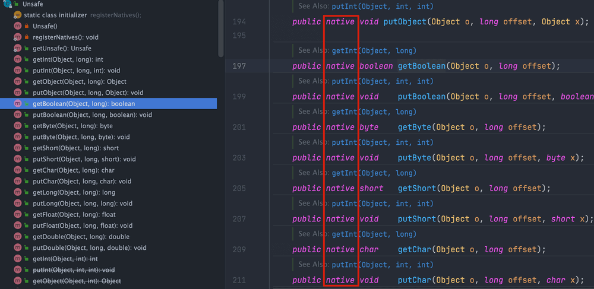

# Unsafe

## 介绍

`Unsafe` 是位于 `sun.misc` 包下的类，主要提供一些用于执行低级别、不安全操作的方法，如直接访问系统内存资源、自主管理内存资源等，这些方法在提升Java运行效率、增强Java语言底层资源操作能力方面起到了很大的作用。但是由于 `Unsafe` 类使 Java语言拥有了类似 C 语言指针一样操作内存空间的能力，这无疑也增加了程序发生相关指针问题的风险。在程序中过度、不正确使用 `Unsafe` 类会使得程序出错的概率变大，使得 Java这种安全的语言变得不再“安全”。

另外，`Unsafe` 提供的这些功能的实现需要依赖本地发给发（Native Method）。你可以将本地方法看作是 Java中使用其它编程语言编写的方法，本地方法使用 `native` 关键字修饰，Java 代码中只是声明方法头，具体的实现则交给 本地代码。



为什么要使用本地方法呢？
1. 需要用到 Java 中不具备的依赖于操作系统的特性，Java 在实现跨平台的同时要实现对底层的控制，需要借助其他语言发挥作用。
2. 对于其他语言已经完成的一些现成功能，可以使用Java 直接调用。
3. 程序对时间敏感或对性能要求非常高，有必要使用更加底层的语言，例如C/C++甚至是汇编。

在 JUC 包的很多并发工具类在实现并发机制时，都调用了本地方法，通过他们打破了Java 运行时的界限，能够接触到操作系统底层的某些功能，对于同一本地方法，不同的操作系统可能会通过不同的方式来实现，但是对于使用者来说是透明的，最终都会得到相同的结果。

## Unsafe创建

`sun.misc.Unsafe` ：

```java
public final class Unsafe {
  // 单例对象
  private static final Unsafe theUnsafe;
  ......
  private Unsafe() {
  }
  @CallerSensitive
  public static Unsafe getUnsafe() {
    Class var0 = Reflection.getCallerClass();
    // 仅在引导类加载器`BootstrapClassLoader`加载时才合法
    if(!VM.isSystemDomainLoader(var0.getClassLoader())) {
      throw new SecurityException("Unsafe");
    } else {
      return theUnsafe;
    }
  }
}
```

`Unsafe` 类为单例模式，提供静态方法`getUnsafe` 获取 `Unsafe` 实例。这个看上去貌似可以用来获取 `Unsafe` 实例。但是，当我们直接调用这个静态方法的时候，会抛出 `SecurityException` 异常：

```java
Exception in thread "main" java.lang.SecurityException: Unsafe
 at sun.misc.Unsafe.getUnsafe(Unsafe.java:90)
 at com.cn.test.GetUnsafeTest.main(GetUnsafeTest.java:12)
```

为什么 `public static` 方法无法被直接调用呢？

这是因为在 `getUnsafe` 方法中，会对调用者的 `classLoader` 进行检查，判断当前类是否由 `Bootstrap classLoader` 加载，如果不是的话那么就会抛出一个 `SecurityException` 异常。也就是说，只有启动类加载器加载的类才能够调用 `Unsafe` 类中的方法，来防止这些方法在不可信的代码中被调用。

那么为什么要对 `Unsafe` 类进行如此谨慎的使用限制呢？

`Unsafe` 提供的功能过于底层（如直接访问系统内存资源，自主管理内存资源等），安全隐患也比较大，使用不当的话，很容易出现很严重的问题。

如若想使用 `Unsafe` 这个类的话，应该如何获取其实例呢？

这里介绍两个可行的方案。

1、 利用反射获得 `Unsafe` 类中已经实例化完成的单例对象 `theUnsafe`。
```java
private static Unsafe reflectGetUnsafe() {
  try {
    Field field = Unsafe.class.getDeclaredField("theUnsafe");
    field.setAccessible(true);
    return (Unsafe) field.get(null);
  } catch(Exception e) {
    log.error(e.getMessage(), e);
    return null;
  }
}
```

2、从 `getUnsafe` 方法的使用限制条件出发，通过Java命令行命令 `-Xbootclasspath/a` 把调用 `Unsafe`相关方法的类 A 所在的 jar 包路径追加到默认的bootstrap 路径中，使得 A 被引导类加载器加载，从而通过 `Unsafe.getUnsafe` 方法安全的获取 `Unsafe` 实例。

`java -Xbootclasspath/a: ${path} // 其中path为调用Unsafe 相关放啊的类所在jar包路径`

## 功能

概括的来说 `Unsafe`类实现功能可以被分为下面 $8$ 类：

1. 内存操作
2. 内存屏障
3. 对象操作
4. 数据操作
5. CAS操作
6. 线程调度
7. Class操作
8. 系统信息
