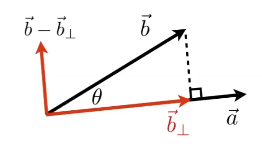
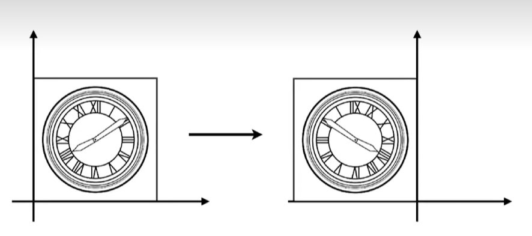
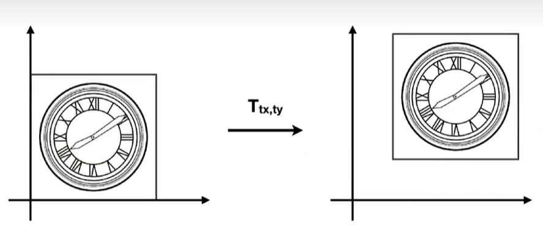
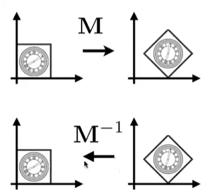
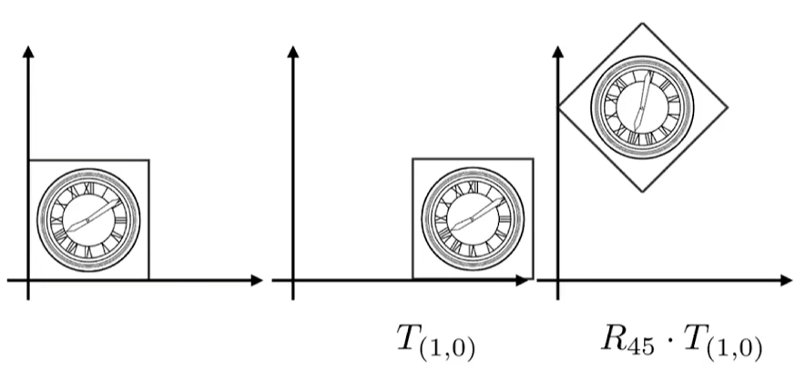
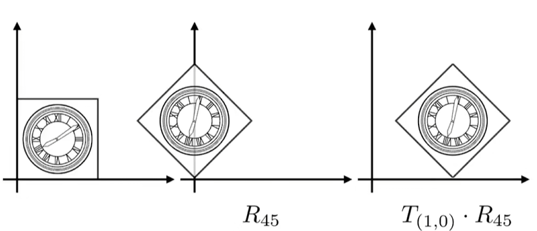
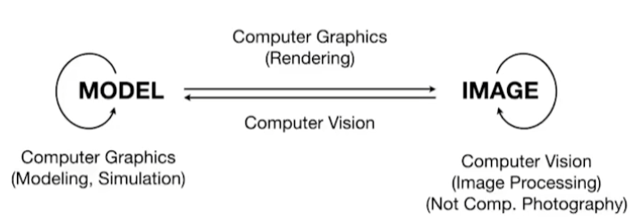

# Computer Graphics

## Liner Algebra

vector(向量)，通常用$\overrightarrow a$或**a**表示，$\overrightarrow AB=B-A$。表示了长度和方向，没有绝对起始位置，例如只要方向和长度一样，坐标系中可以从任意位置开始，其向量都是相等的。

使用$\Vert\overrightarrow a\Vert$表示$\overrightarrow a$的长度，常用于计算单位向量$\widehat a=\frac{\overrightarrow a}{\Vert\overrightarrow a\Vert}$。

向量$A(x,y)$，使用矩阵方法表示通常使用列向量：$A=\begin{pmatrix}x\\y\\ \end{pmatrix}$

### Dot Product(点乘)

$$\overrightarrow a \cdot\overrightarrow b=\Vert a\Vert\Vert b\Vert \cos\theta$$
可以知道向量点乘的结果是一个数。
$$\cos\theta=\frac{\overrightarrow a\cdot\overrightarrow b}{\Vert a\Vert\Vert b\Vert}$$

矩阵：
$$\overrightarrow a\cdot\overrightarrow b=
\begin{pmatrix}
x_a\\
y_a\\ 
\end{pmatrix}\cdot
\begin{pmatrix}
x_b\\
y_b\\
\end{pmatrix}=
x_ax_b+y_ay_b$$

常常用于已知两个向量，去找到其夹角。
也可以找到一个向量到另一个向量的投影。

- $\overrightarrow b_{\bot}$:$\overrightarrow b$在$\overrightarrow a$的投影。
    - $\overrightarrow b_{\bot}=k\widehat a$
    - $k=\Vert\overrightarrow b_{\bot}\Vert=\Vert\overrightarrow b\Vert\cos\theta$

这样也可以将一个向量分解成两个向量（垂直于平行的分解），例如：

可以比较两个向量的方向是否接近，例如下图中$\overrightarrow a$和$\overrightarrow b$方向基本相近，而$\overrightarrow a$与$\overrightarrow c$方向基本相反

### Cross product(叉乘)

$$\overrightarrow a\times\overrightarrow b=
\begin{pmatrix}
y_az_b-y_bz_a\\
z_ax_b-x_az_b\\
x_ay_b-y_ax_b\\
\end{pmatrix}$$

而如果使用矩阵乘法表示：
$$\overrightarrow a\times\overrightarrow b=A^*b=
\begin{pmatrix}
0&-z_a&y_a\\
z_a&0&-x_a\\
-y_a&x_a&0\\
\end{pmatrix}
\begin{pmatrix}
x_b\\
y_b\\
z_b\\
\end{pmatrix}$$

**可以判断左和右，内和外的信息**

如上图左，要想判断$\overrightarrow b$在$\overrightarrow a$的左侧还是右侧，则可以根据$\overrightarrow a\times\overrightarrow b$得到，如果在左侧，那么得到的就是$\overrightarrow z$方向的向量，否则是$-\overrightarrow z$方向的向量，自然可以根据这个，判断一个点是否在三角形内部。例如上图右，已知$A,B,C$三点，判断$P$是否在三角形$ABC$中，则只需要判断$\overrightarrow {AB}\times\overrightarrow {AP}$,$\overrightarrow {BC}\times\overrightarrow {BP}$,$\overrightarrow {CA}\times\overrightarrow {CP}$是否得到的P所相对于其边方向都在同一侧即可，例如上图，$\overrightarrow {AP},\overrightarrow {BP},\overrightarrow {CP}$分别在$\overrightarrow {AB},\overrightarrow {BC},\overrightarrow {CA}$的左侧，那么可以知道点$P$在三角形$ABC$中。

## Transformation

### Linear Transforms

#### Scale Matrix

使用矩阵表示：

$$
\begin{bmatrix}
x'\\
y'\\
\end{bmatrix}
=
\begin{bmatrix}
s_x&0\\
0&s_y\\
\end{bmatrix}
\begin{bmatrix}
x\\
y\\
\end{bmatrix}
$$

#### Reflection Matrix

如上图是将左边的图形按照$y$轴对称得到右边，使用矩阵可以表示为：
$$
\begin{bmatrix}
x'\\
y'\\
\end{bmatrix}
=
\begin{bmatrix}
-1&0\\
0&1\\
\end{bmatrix}
\begin{bmatrix}
x\\
y\\
\end{bmatrix}
$$

#### Shear Matrix

由上图，可以知道$(0,0)$点处不会变换，而$(0,1)$处变为$(a,1)$可以知道，$y$相同的点$x$的变换值相同，也就是$(x',y')=(x+ay,y)$，使用矩阵可以表示为：

$$
\begin{bmatrix}
x'\\
y'
\end{bmatrix}
=
\begin{bmatrix}
1&a\\
0&1\\
\end{bmatrix}
\begin{bmatrix}
x\\
y\\
\end{bmatrix}
$$

#### Rotate

如上图，将左图进行旋转$45°$操作，得到右图。那么我们可以假设旋转角度为$\theta$，则有下图（边长为1的情况）：

以两个特殊点为例，取左上角和右下角两点，原坐标分别是$(0,1)$与$(1,0)$，对于它们经过了以下矩阵变换得到了新坐标：

$$
\begin{bmatrix}
a&b\\c&d\\
\end{bmatrix}
$$

已知新坐标分别是$(-\sin\theta, \cos\theta)$与$(\cos\theta,\sin\theta)$，那么可以求得$a,b,c,d$的值。

$$
(b,d)=(-\sin\theta, \cos\theta)\\
(a,c)=(\cos\theta,\sin\theta)
$$

自然就有$(x',y')=(x\cos\theta-y\sin\theta,x\sin\theta+y\cos\theta)$即：

$$
\begin{bmatrix}
x'\\
y'\\
\end{bmatrix}
=
\begin{bmatrix}
\cos\theta&-\sin\theta\\
\sin\theta&\cos\theta\\
\end{bmatrix}
\begin{bmatrix}
x\\
y\\
\end{bmatrix}
$$

#### Linear Transform

线性变换可以归结为如下形式：

$$
x'=ax+by\\
y'=cx+dy\\
\\
\begin{bmatrix}
x'\\y'\\
\end{bmatrix}
=
\begin{bmatrix}
a&b\\
c&d\\
\end{bmatrix}
\begin{bmatrix}
x\\y
\end{bmatrix}
$$

### Affine Transform

线性变换是仿射变换的一个子集

#### Translation

如上图，将图形平移，能够很简单的表示出来，例如平移$(t_x,t_y)$，可以得到$x'=x+t_x,y'=y+t_y$，可是我们无法使用$x'=Mx$的形式去表示，那么如何将这些变换使用统一的表示方法表示呢？

我们定义一个二维点使用$(x,y,1)$表示，二维向量使用$(x,y,0)$表示，这也就是齐次坐标系，那么以上变换使用矩阵表示也就是：

$$
\begin{bmatrix}
x'\\y'\\1
\end{bmatrix}
=
\begin{bmatrix}
1&0&t_x\\
0&1&t_y\\
0&0&1\\
\end{bmatrix}
\begin{bmatrix}
x\\y\\1
\end{bmatrix}
$$

对于齐次坐标系，两个点相加，第三维的值就大于$1$了，如点$(x,y,w)(w!=0)$，其真正表示的点是$(x/w,y/w,1)$，而向量与向量加减运算仍然是向量，按照定义，点与向量相加是点。点与点相减则变成向量。

那么上述线性变换的矩阵则可以改为：

$$
Scale:
\begin{bmatrix}
x'\\y'\\1
\end{bmatrix}
=
\begin{bmatrix}
s_x&0&0\\
0&s_y&0\\
0&0&1\\
\end{bmatrix}
\begin{bmatrix}
x\\y\\1
\end{bmatrix}
\\
Rotation:
\begin{bmatrix}
x'\\y'\\1
\end{bmatrix}
=
\begin{bmatrix}
\cos\alpha&-\sin\alpha&0\\
\sin\alpha&\cos\alpha&0\\
0&0&1\\
\end{bmatrix}\\
Translation:
\begin{bmatrix}
1&0&t_x\\
0&1&t_y\\
0&0&1\\
\end{bmatrix}
$$

### 总结

上面，我们把几种变换都可以表示成$x'=Mx$的形式，那么根据矩阵的特性，$MM^{-1}=E$，可以对图形进行逆变换，其矩阵就是$M^{-1}$。

实际中，图形变换肯定不会是单一变换，而是几种变换混合，那么其关于使用矩阵进行变换的顺序有没有什么区别呢？

可以知道其顺序对结果有影响，其矩阵本身的乘法也说明了这一点即：$R_{45}T_{(1,0)}!=T_{(1,0)}R_{45}$

对于一系列仿射变换，我们用$A_1,A_2,....,A_n$表示。按照1~n的顺序开始，那么就可以写成下列形式：

$$
A_n(...A_2(A_1(x)))=A_n\cdot...A_2\cdot A_1\cdot
\begin{bmatrix}
x\\y\\1
\end{bmatrix}
$$

如上图的变换，并不是进行直接的Rotate Matrix变换，而是将一个旋转变换分解成多个变换，先是进行$T(-c)$变换将图形移动到原点进行下一步$Rotate$操作，最后$T(c)$将图形变换回去。

## Rasterization（光栅化）

将三维空间的几何形体显示在屏幕上就是光栅化。

- 将几何图元（3D三角形/多边形）投影到屏幕上
- 将投影图元分解为片段（像素）
- 视频游戏中的黄金标准（实时应用程序）

## Curves and Meshes（曲线和网格）

## Ray Tracing（光线追踪）

## Animation/Simulation（动画/模拟）