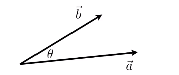
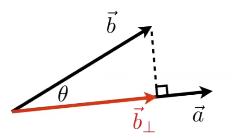
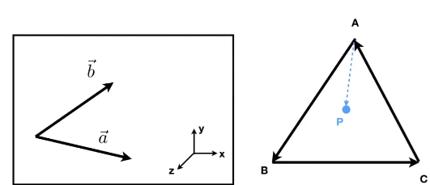
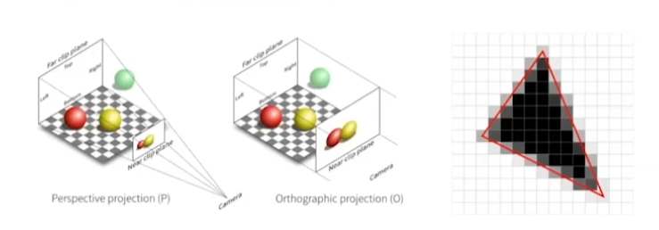

# Computer Graphics

## Liner Algebra

vector(向量)，通常用$\overrightarrow a$或**a**表示，$\overrightarrow AB=B-A$。表示了长度和方向，没有绝对起始位置，例如只要方向和长度一样，坐标系中可以从任意位置开始，其向量都是相等的。

使用$\Vert\overrightarrow a\Vert$表示$\overrightarrow a$的长度，常用于计算单位向量$\widehat a=\frac{\overrightarrow a}{\Vert\overrightarrow a\Vert}$。

向量$A(x,y)$，使用矩阵方法表示通常使用列向量：$A=\begin{pmatrix}x\\y\\ \end{pmatrix}$

### Dot Product(点乘)

$$\overrightarrow a \cdot\overrightarrow b=\Vert a\Vert\Vert b\Vert \cos\theta$$
可以知道向量点乘的结果是一个数。
$$\cos\theta=\frac{\overrightarrow a\cdot\overrightarrow b}{\Vert a\Vert\Vert b\Vert}$$

矩阵：
$$\overrightarrow a\cdot\overrightarrow b=
\begin{pmatrix}
x_a\\
y_a\\ 
\end{pmatrix}\cdot
\begin{pmatrix}
x_b\\
y_b\\
\end{pmatrix}=
x_ax_b+y_ay_b$$

常常用于已知两个向量，去找到其夹角。
也可以找到一个向量到另一个向量的投影。

- $\overrightarrow b_{\bot}$:$\overrightarrow b$在$\overrightarrow a$的投影。
    - $\overrightarrow b_{\bot}=k\widehat a$
    - $k=\Vert\overrightarrow b_{\bot}\Vert=\Vert\overrightarrow b\Vert\cos\theta$

这样也可以将一个向量分解成两个向量（垂直于平行的分解），例如：

可以比较两个向量的方向是否接近，例如下图中$\overrightarrow a$和$\overrightarrow b$方向基本相近，而$\overrightarrow a$与$\overrightarrow c$方向基本相反

### Cross product(叉乘)

$$\overrightarrow a\times\overrightarrow b=
\begin{pmatrix}
y_az_b-y_bz_a\\
z_ax_b-x_az_b\\
x_ay_b-y_ax_b\\
\end{pmatrix}$$

而如果使用矩阵乘法表示：
$$\overrightarrow a\times\overrightarrow b=A^*b=
\begin{pmatrix}
0&-z_a&y_a\\
z_a&0&-x_a\\
-y_a&x_a&0\\
\end{pmatrix}
\begin{pmatrix}
x_b\\
y_b\\
z_b\\
\end{pmatrix}$$

**可以判断左和右，内和外的信息**

如上图左，要想判断$\overrightarrow b$在$\overrightarrow a$的左侧还是右侧，则可以根据$\overrightarrow a\times\overrightarrow b$得到，如果在左侧，那么得到的就是$\overrightarrow z$方向的向量，否则是$-\overrightarrow z$方向的向量，自然可以根据这个，判断一个点是否在三角形内部。例如上图右，已知$A,B,C$三点，判断$P$是否在三角形$ABC$中，则只需要判断$\overrightarrow {AB}\times\overrightarrow {AP}$,$\overrightarrow {BC}\times\overrightarrow {BP}$,$\overrightarrow {CA}\times\overrightarrow {CP}$是否得到的P所相对于其边方向都在同一侧即可，例如上图，$\overrightarrow {AP},\overrightarrow {BP},\overrightarrow {CP}$分别在$\overrightarrow {AB},\overrightarrow {BC},\overrightarrow {CA}$的左侧，那么可以知道点$P$在三角形$ABC$中。

## Rasterization（光栅化）

将三维空间的几何形体显示在屏幕上就是光栅化。

- 将几何图元（3D三角形/多边形）投影到屏幕上
- 将投影图元分解为片段（像素）
- 视频游戏中的黄金标准（实时应用程序）

## Curves and Meshes（曲线和网格）

## Ray Tracing（光线追踪）

## Animation/Simulation（动画/模拟）