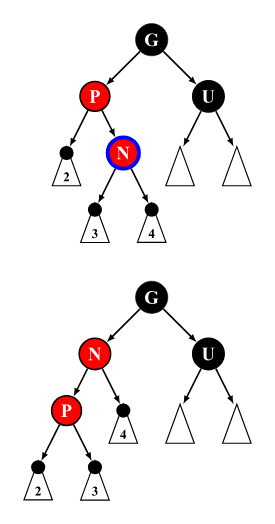

# 红黑树

红黑树是一种自平衡的二叉搜索树，每个节点额外存储了一个color字段（“RED”or“BLACK”），用于确保树再插入和删除时保持平衡。

## 性质

一棵合法的红黑树必须遵循以下四条性质：
1. 节点为红色或黑色。
2. $NIL$节点（空叶子节点）为黑色。
3. 红色节点的子节点为黑色。
4. 从根节点到$NIL$节点的每条路径上的黑色节点数量相同。

下图为一棵合法的红黑树：


注：部分资料中还加入了第五条性质，即根节点必须为黑色，这条性质要求完成插入操作后若根节点为红色则将其染黑，但由于将根节点染黑的操作也可以延迟至删除操作时进行，因此，该条性质并非必须满足。

## 结构

### 红黑树的定义

```c++
template<typename Key, typename Value, typename Compare = std::less<Key>>
Class RBTreeMap {
    //排序函数
    Compare compare = Compare();

    //节点结构体
    struct Node {
        ...
    };

    //根节点指针
    Node* root = nullptr;
    //记录红黑树中当前的节点个数
    size_t count = 0;
};
```

### 节点维护的信息

|Identifier|Type|Description|
|----------|----|-----------|
|`left`|`Node*`|左子节点指针|
|`right`|`Node*`|右子节点指针|
|`parent`|`Node*`|父节点指针|
|`color`|`enum{BLACK,RED}`|颜色枚举|
|`key`|`Key`|节点键值，具有唯一性和可排序性|
|`value`|`Value`|节点内存储的值|

注：由于本文提供的代码示例中使用`std::share_ptr`进行内存管理，对此不熟悉的可以将下文中所有`NodePtr`和`ConstNodePtr`理解为裸指针`Node*`。但在实现删除操作时若使用`Node*`作为节点引用需要注意手动释放内存以避免内存泄漏，该操作在使用`std::shared_ptr`作为节点引用的示例代码中并未体现。

## 过程

注：由于红黑树是由$B$树衍生而来（发明时的最初名字$symmetric binary B-tree$足以证明这点），并非直接由平衡二叉树外加限制条件推导而来，插入操作的后续维护和删除操作的后续维护中部分对操作的解释作用仅是帮助理解，并不能将其作为该操作的原理推导和证明

### 旋转操作

旋转操作是多数平衡树能够维持平衡的关键，它能在不改变一棵合法的$BST$中序遍历结果的情况下改变局部节点的深度。


如上图，从左图到右图的过程被称为右旋，右旋操作会使得$T3$子树上结点的深度均加$1$，使$T1$子树上结点的深度均减$1$，而$T2$子树上结点的深度则不变。从右图到左图的过程被称为左旋，左旋是右旋的镜像操作。

这里给出红黑树中节点的左旋操作的示例代码：

```c++
void rotateLeft(ConstNodePtr node) {
    // clang-format off
    //     |                       |
    //     N                       S
    //    / \     l-rotate(N)     / \
    //   L   S    ==========>    N   R
    //      / \                 / \
    //     M   R               L   M
    assert(node != nullptr && node->right != nullptr);
    //clang-format on
    NodePtr parent = node->parent;
    Direction direction = node->direction();

    NodePtr successor = node->right;
    node->right = successor->left;
    successor->left = node;

    //以下操作用于维护各个节点的parent指针
    //Direction的定义以及maintainRelationship
    //的实现请参照文章末尾的完整示例代码
    maintainRelationship(node);
    maintainRelationship(successor);

    switch(direction) {
        case Direction::ROOT:
            this->root = successor;
            break;
        case Direction::LEFT:
            parent->left = successor;
            break;
        case Direction::RIGHT:
            parent->right = successor;
            break;
    }

    successor->parent = parent;
}
```
注：代码中的`successor`并非平衡树中的后继节点，而是表示取代原本节点的新节点，由于在图示中`replacement`简称`R`会与右子节点的简称`R`冲突，因此此处使用`successor`避免歧义。

### 插入操作

红黑树的插入操作与普通的$BST$类似，对于红黑树来说，新插入的节点初始为红色，完成插入后需根据插入节点及相关节点的状态进行修正以满足上文提到的四条性质。

### 插入后的平衡维护
#### Case1

该树原先为空，插入第一个节点后不需要进行修正。

#### Case2

当前节点的父节点为黑色且为根节点，这时性质已经满足，不需要进行修正。

#### Case3

当前节点$N$的父节点$P$是为根节点且为红色，将其染为黑色，此时性质也已满足，不需要进一步修正。

```c++
// clang-format off
// Case 3: Parent is root and is RED
//   Paint parent to BLACK.
//    <P>         [P]
//     |   ====>   |
//    <N>         <N>
//   p.s.
//    `<X>` is a RED node;
//    `[X]` is a BLACK node (or NIL);
//    `{X}` is either a RED node or a BLACK node;
// clang-format on
assert(node->parent->isRed());
node->parent->color = Node::BLACK;
return;
```

#### Case4

当前节点$N$的父节点$P$和叔节点$U$均为红色，此时$P$包含了一个红色子节点，违反了红黑树的性质，需要进行重新染色。由于在当前节点$N$之前该树是一棵合法的红黑树，根据性质3可以确定$N$的祖父节点$G$一定是黑色，这时只要后续操作可以保证以$G$为根节点的子树在不违反性质4的情况下再递归维护祖父节点$G$以保证性质3即可。

因此这种情况的维护需要：
1. 将$P$，$U$节点染黑，将$G$节点染红（可以保证每条路径上黑色节点个数不发生改变）。
2. 递归维护$G$节点（因为不确定$G$的父节点的状态，递归维护可以确保性质3成立）。


```c++
// clang-format off
// Case 4: Both parent and uncle are RED
//   Paint parent and uncle to BLACK;
//   Paint grandparent to RED.
//        [G]             <G>
//        / \             / \
//      <P> <U>  ====>  [P] [U]
//      /               /
//    <N>             <N>
// clang-format on
assert(node->parent->isRed());
node->parent->color = Node::BLACK;
node->uncle()->color = Node::BLACK;
node->grandParent()->color = Node::RED;
maintainAfterInsert(node->grandParent());
return;
```

#### Case5

当前节点$N$与父节点$P$的方向相反（即$N$节点为右子节点且父节点为左子节点，或$N$节点为左子节点且父节点为右子节点。类似$AVL$树中$LR$和$RL$的情况）。根据性质4，若$N$为新插入节点，$U$则为$NIL$黑色节点，否则为普通黑色节点。

该种情况无法直接进行维护，需要通过旋转操作将子树结构调整为Case6的初始状态并进入Case6进行后续维护。



```c++
// clang-format off
// Case 5: Current node is the opposite direction as parent
//   Step 1. If node is a LEFT child, perform l-rotate to parent;
//           If node is a RIGHT child, perform r-rotate to parent.
//   Step 2. Goto Case 6.
//      [G]                 [G]
//      / \    rotate(P)    / \
//    <P> [U]  ========>  <N> [U]
//      \                 /
//      <N>             <P>
// clang-format on

// Step 1: Rotation
NodePtr parent = node->parent;
if (node->direction() == Direction::LEFT) {
  rotateRight(node->parent);
} else /* node->direction() == Direction::RIGHT */ {
  rotateLeft(node->parent);
}
node = parent;
// Step 2: vvv
```
#### Case6

当前节点$N$与父节点$P$的方向相同（即$N$节点为右子节点且父节点为右子节点，或$N$节点为左子节点且父节点为右子节点。类似$AVL$树中$LL$和$RR$的情况）。根据性质4，若$N$为新插入节点，$U$则为$NIL$黑色节点，否则为普通黑色节点。

在这种情况下，若想在不改变结构的情况下使得子树满足性质3，则需将$G$染成红色，将$P$染成黑色。但若这样维护的话则性质4被打破，且无法保证在$G$节点的父节点上性质3是否成立。而选择通过旋转改变子树结构后再进行重新染色即可同时满足性质3和4.

因此，这种情况的维护需要：
1. 若$N$为左子节点则右旋祖父节点$G$，否则左旋祖父节点$G$(该操作使得旋转过后$P-N$这条路径上的黑色节点个数比$P-G-U$这条路径上少$1$，暂时打破性质4).
2. 重新染色，将$P$染黑，将$G$染红，同时满足性质3和4。


