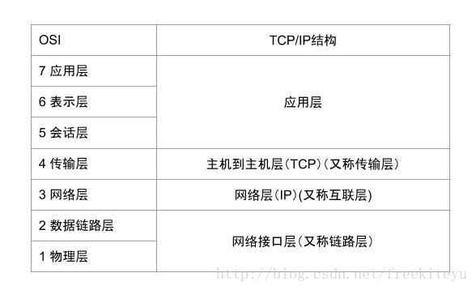
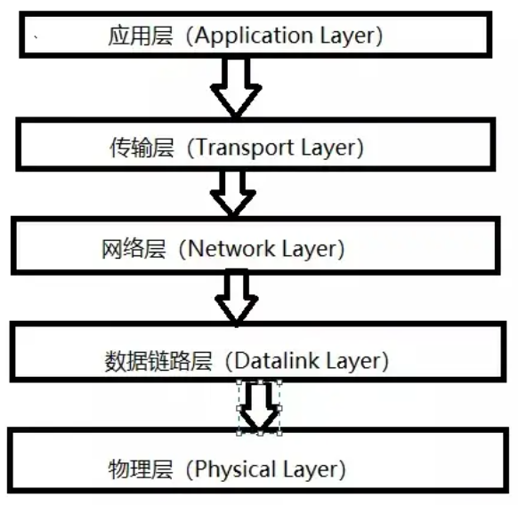

# TCP/IP

TCP/IP是互联网相关的各类协议族的总称，比如：TCP，UDP，IP，FTP，HTTP，ICMP，SMTP等都属于TCP/IP族内的协议，像这样把与互联网相关联的协议集合起来总称为TCP/IP，也有说法认为，TCP/IP指TCP和IP这两种协议，也有指在IP协议通信过程中，使用到的协议族统称。

- OSI参考模型

OSI参考模型是ISO的建议，它是为了使各层上的协议国际标准化而发展起来的，OSI参考模型全称是开放系统互连参考模型（Open System Interconnection Reference Model），这一参考模型分为七层。

- TCP/IP参考模型

TCP/IP参考模型是首先由ARPANET所使用的网络体系结构，这个体系结构在它的两个主要协议出现以后被称为TCP/IP参考模型（TCP/IP Reference Model）。这一网络协议分为四层：数据链路层，网络层，传输层，应用层。

# TCP/IP的分层管理

TCP/IP协议族里最重要的一点就是分层，把TCP/IP层次化是有好处的，例如，如果互联网只由一个协议统筹，某个地方需要改变设计时，就必须把所有部分整体替换掉。而分层之后只需把变动的层替换掉即可。把各层之间的接口部分规划好之后，每个层次内部的设计就能自由改动。

# 计算机如何通信

如图，为网络通信的五层模型：

## 物理层

一台计算机与另一台计算机要进行通信，第一件要做的事是什么？即把这台计算机与另一台计算机连接起来，这样，我们才能把数据传输过去，例如通过光纤，电缆，双绞线等介质把他们连接起来，然后才能通信。

也就是说，物理层负责把两台计算机连接起来，然后在计算机之间通过高低电频来传送0，1这样的电信号。

## 数据链路层

前面说了，物理层只是单纯的让两个计算机连接起来，并且传输01电信号，如果这些01电信号组合的传送毫无规则，计算机无法解读。

因此，我们需要制定一套规则来进行0，1的传送。例如多少个电信号为一组，每一组信号应该如何标识。

### 以太网协议

以太网协议规定，一组电信号构成一个数据包，我们把这个数据包称之为帧，每一个帧由标头和数据两部分组成。

帧的大小一般为64~1518个字节，假如需要传送的数据很大的话，就分成多个帧来进行传送。

对于标头和数据这两部分，他们存放的都是一些什么数据呢？首先我们得知道这个帧是谁发送的，发送给谁的等信息。因此标头部分主要是一些说明数据，例如发送者，接收者的信息，而数据部分则是这个数据包具体的，想给接收者的内容。

一个帧的长度64~1518字节，也就是说每个帧的长度不固定，但是标头是固定的，为18字节。

把一台计算机的数据通过物理层和链路层发送给另一个计算机，究竟是谁发送给谁，计算机与计算机之间如何区分，于是MAC地址出现了。

### MAC地址

连入网络的每一个计算机都会有网卡接口，每个网卡都会有一个唯一标识的地址，这个地址就叫做MAC地址，计算机之间的数据传送，就是通过MAC地址来唯一寻找、传送的。

MAC地址由48个字节所构成，在网卡生产时就被唯一标识了。

### 广播与ARP协议

假如，有四个计算机被连接起来，分别是ABCD。如果计算机A知道了计算机B的MAC地址，然后计算机A想要给计算机B传送数据，虽然计算机A知道了计算机B的MAC地址，可是它要怎么给它传送数据呢？计算机A不仅连接着计算机B还连接着其它的计算机。虽然计算机A知道计算机B的MAC地址，可是计算机A不知道计算机B分布在哪一条线路，于是有了广播的出现。

在同一个子网中，计算机A要向计算机B发送一个数据包，这个数据包会包含接收者的MAC地址，当发送时，计算机A是通过广播的方式发送的，这时同一个子网中的计算机CD也会收到这个数据包，然后收到这个数据包的计算机，会把数据包的MAC地址取出来，与自身的MAC地址对比，如果两者相同，则接收这个数据包，否则就丢弃这个数据包，这种发送方式我们称之为广播，就像在广场上喊人，所有人可以听见，但只有是这个名字的人才会搭理。

那么问题来了，计算机A如何知道计算机B的MAC地址呢？这时候就得由ARP协议解决，ARP会涉及到IP地址，此处先了解ARP可以获得子网中其它计算机的MAC地址。

## 网络层

上面有说到子网这个关键词，实际上我们所处的网络是由无数个子网络构成的，广播的时候，也只有同一个子网里面的计算机能够收到。

假如没有子网这种划分的话，计算机A通过广播的方式发送一个数据包给计算机B，其它所有计算机也都能收到这个数据包，然后进行对比再舍弃。假如没有子网，那么每一台计算机都能收到其它计算机发送的数据包，那么对网络的压力非常大，因此才有了子网。

那么我们如何区分哪些MAC地址属于同一个子网呢？假如是同一个子网，那么我们就用广播的形式把数据传送给对方，如果不是同一个子网，我们就把数据发送给网关，让网关进行转发。

### IP协议

IP协议，它所定义的地址，我们称之为IP地址，IP协议有两种版本，一种是IPV4，另一种是IPV6.不过我们目前大多数使用的还是IPV4。此处只讨论IPV4协议。

这个IP地址由32位的二进制数组成，我们一般使用4段十进制表示，地址范围为：0.0.0.0~255.255.255.255。

每一台想要联网的计算机都会有一个IP地址。这个IP地址被分为两部分，前面一部分代表网络部分，后面一部分代表主机部分，并且网络部分和主机部分所占用的二进制位是不固定的。

假如两台计算机的网络部分是一模一样的，我们就说这两台计算机是处于同一个子网中，例如192.168.43.1和192.168.43.2，假如这两个IP地址的网络部分都是24位，主机部分8位，那么他们的网络部分都是192.168.43，所以他们处于同一个子网当中。

可是问题来了，我们如何知道网络部分是占几位呢？也就是说单单凭借IP地址还无法判断两个计算机是否处于同一个子网当中。

这就出现了另一个关键词——子网掩码，子网掩码和IP地址一样是一个32位二进制数，不过它的网络部分规定全部为1，主机部分规定全是0，也就是说，假如上面两个IP地址的网络部分都是24位，那么他们的子网掩码都是255.255.255.0。

那有了子网掩码，如何来判断IP地址是否处于同一个子网当中呢，显然，知道了子网掩码，相当于我们知道了网络部分是几位，主机部分是几位，我们只需要把IP地址与它的子网掩码进行逻辑与运算，然后把各自的结果进行比较即可。如果比较的结果相同，则代表是同一个子网，否则不是。

例如，192.168.43.1和192.168.43.2的子网掩码都是255.255.255.0，把IP地址与子网掩码进行逻辑与，可以得到他们都为192.168.43.0，进而知道他们在同一个子网中。

A类IP地址 1.0.0.0 ~ 127.0.0.0
B类IP地址 128.1.0.0 ~ 191.254.0.0
C类IP地址 192.0.1.0 ~ 223.255.254.0
D类IP地址 224.0.0.0 ~ 239.255.255.255 用于多点广播
E类IP地址 保留

### ARP协议

有了上面的IP协议知识，回来再看ARP协议。

有了两台计算机的IP地址和子网掩码，我们可以轻而易举的判断它们是否在同一个子网当中。

假如它们处于同一个子网之中，计算机A要给计算机B发送数据时，我们可以通过ARP协议来得到计算机B的MAC地址。

ARP协议也是通过广播的形式给同一个子网中的每台计算机发送一个数据包（当然，这个数据包会包含接收方的IP地址），对方收到这个数据包之后，会取出IP地址与自身对比，如果相同，则把自己的MAC地址回复给对方，否则就丢弃这个数据包，这样计算机A就能知道计算机B的MAC地址了。

知道了MAC地址之后，发送数据是通过广播的形式放发送，询问对方的MAC地址也是通过广播的形式来发送。那其它计算机怎么知道你是要传送数据还是询问MAC地址呢？其实在询问MAC地址的数据包中，在对方MAC地址一栏中，填的是一个特殊的MAC地址，其它计算机看到这个特殊的MAC地址之后，就能知道广播想干嘛了。

### DNS服务器

这里再说一个问题，MAC地址是通过知道对方IP地址通过ARP获得的，那么对方IP地址又是如何获得的呢？当我们想要访问某个网站的时候，我们可以输入IP来进行访问，但是大多数一定是输入网址域名来访问，例如百度wwww.baidu.com，其实当我们输入这个域名后，会有一个叫做DNS服务器来帮我们解析这个域名，然后返回这个域名对应的IP给我们。

因此，网络层的功能就是让我们找到对方计算机在哪，是否属于一个子网等。

## 传输层

通过物理层，数据链路层以及网络层的互相帮助，我们已经把数据成功从计算机A传送到计算机B了，可是，计算机B里面有各种各样的应用程序，计算机该如何知道这些数据是给谁的呢？

这个时候，端口（Port）就出现了，也就是说，我们在从计算机A传送数据给计算机B的时候，我们还得指定一个端口，以供特定的应用程序来接收处理。

也就是说，传输层的功能就是建立端口到端口的通信，相比网络层的功能是建立主机到主机的通信。

只有有了IP和端口，我们才能准确的通信，这个时候或许会问，我们输入IP地址的时候并没有指定端口，其实有些传输协议，已经有预先定义好的默认端口，例如http的80端口，socks的1080端口，FTP的21端口，Telnet的23端口，https的443端口。

传输层最常见的两大协议是TCP协议和UDP协议，其中TCP协议与UDP最大的不同就是TCP提供可靠的传输，而UDP提供的是不可靠传输。

## 应用层

虽然我们收到了传输层传来的数据，可是这些传过来的数据五花八门，有html格式的有MP4格式的，各种各样。

因此我们需要指定这些数据的格式规则，收到后才好解读渲染，例如最常见的HTTP数据包中，就会指定该数据包是什么格式的文件了。

